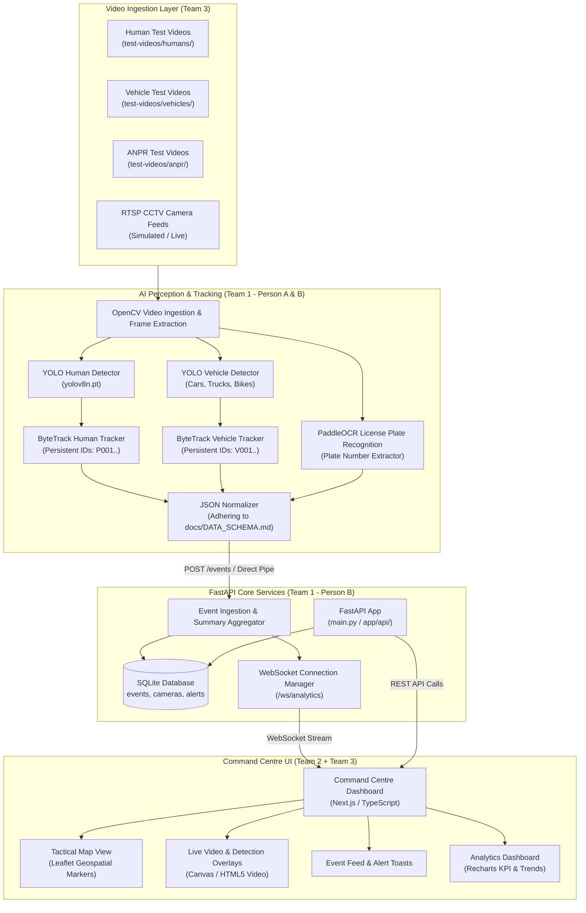

# IBVAP — System Architecture & Pipeline Specification
**Version:** 1.0.0  
**Status:** FROZEN — System Design & Integration Blueprint

---

## 1. Executive Summary

The **Intelligent Border Video Analytics Platform (IBVAP)** is designed to transform existing border CCTV infrastructure into an AI-enabled real-time situational awareness and command surveillance system.

### Core Processing Flow
```
CCTV / Video Ingestion
      │
      ▼
AI Perception (Detection & Classification)
      │
      ▼
Multi-Object Tracking (ByteTrack)
      │
      ▼
Rules / Behaviour Engine (Phase 1 Basic / Phase 2 Advanced)
      │
      ▼
Events Generation & Storage (SQLite / FastAPI)
      │
      ▼
Alerts & Real-Time Broadcast (WebSocket Hub)
      │
      ▼
Command Centre Dashboard (Next.js, Leaflet, Recharts)
```

---

## 2. End-to-End System Architecture Diagram



---

## 3. Real vs. Simulated Features (Phase 1 vs. Phase 2)

To deliver a rock-solid prototype without overpromising or breaking sprint timelines, features are partitioned strictly into **Phase 1 (Real AI)** and **Phase 2 (Simulated Placeholders)**.

### Phase 1 — Real AI Implementation (Current Sprint)
| Feature | AI Engine / Implementation | Output Schema |
| :--- | :--- | :--- |
| **Human Detection** | Ultralytics YOLOv8 (Class: `person`) | `docs/DATA_SCHEMA.md` Section 3 |
| **Human Tracking** | ByteTrack multi-object persistent tracking | `docs/DATA_SCHEMA.md` Section 3 |
| **Vehicle Detection** | Ultralytics YOLOv8 (`car`, `truck`, `bus`, `motorcycle`) | `docs/DATA_SCHEMA.md` Section 4 |
| **Vehicle Classification** | YOLO class mapping to standard vehicle taxonomy | `docs/DATA_SCHEMA.md` Section 4 |
| **ANPR (Plate Recognition)** | Plate detection + PaddleOCR text recognition | `docs/DATA_SCHEMA.md` Section 5 |

### Phase 1 — Simulated / UI Placeholders (Explicitly Labeled)
| Simulated Feature | UI Representation | Simulation Implementation |
| :--- | :--- | :--- |
| **Intrusion Detection / Virtual Fence** | Red polygon bounding breach zone on dashboard map/video | Triggered via mock alert event (`INTRUSION`) with `"is_phase_2_simulated": true` |
| **Historical Analytics** | 24-hour and 7-day trend charts | Seeded via mock historical database records |
| **Camera Health Analytics** | FPS, network latency, jitter indicators | Mock metric generator emitting periodic `camera_status` |
| **Multi-camera Threat Aggregation** | Threat escalation status bar | Rules-based aggregation on event counts |
| **Advanced Behavioural Analytics** | Loitering, running, unattended baggage | Placeholder card indicating "Phase 2 AI Module" |

### Phase 2 — Future Production Roadmap (Do NOT implement in current sprint)
1. Real mathematical polygon virtual fencing & ray-casting intrusion detection.
2. Behavioural anomaly recognition (loitering timers, panic running, crawling).
3. Facial recognition & cross-camera watchlist matching.
4. Thermal / Infrared night-vision contrast enhancement.
5. Military / Law-Enforcement C2 integration bridges.

---

## 4. Technology Stack & Baseline Decisions

We adopt a lightweight, robust, and monolithic-first prototype stack.

### Backend & AI Stack
- **Language:** Python 3.10+
- **API Framework:** FastAPI
- **Data Validation:** Pydantic v2
- **Data Storage:** SQLite (zero-config, high performance for local prototypes)
- **Real-Time Streaming:** FastAPI native WebSockets (`websockets`)
- **Computer Vision:** OpenCV (`opencv-python-headless` or `opencv-python`)
- **Object Detection & Tracking:** Ultralytics YOLOv8 (`ultralytics`), ByteTrack
- **OCR Engine:** PaddleOCR (`paddleocr`, `paddlepaddle`) or EasyOCR fallback

### Frontend Stack
- **Framework:** Next.js 14+ (App Router) / React 18+
- **Language:** TypeScript
- **Styling:** Tailwind CSS + Vanilla CSS enhancements
- **Mapping:** Leaflet & React-Leaflet
- **Data Visualization:** Recharts
- **Icons:** Lucide React

### Infrastructure Simplicity Principle
> [!IMPORTANT]
> The team MUST NOT introduce unnecessary operational complexity:
> - **NO** Kubernetes or K3s clusters
> - **NO** Triton Inference Server
> - **NO** Redis or Memcached
> - **NO** Kafka, RabbitMQ, or Celery distributed queues
> - **NO** External cloud databases or vendor lock-in services
>
> All components must run locally via simple Python commands and `npm run dev`.

---

## 5. Team Ownership Matrix

```
SIH/
├── backend/                  ---> Team 1 (Person B)
├── ai/                       ---> Team 1 (Person A: Human, Person B: Vehicle/ANPR)
├── models/                   ---> Team 1
├── scripts/                  ---> Team 1 & Shared Mock Data
├── frontend/                 ---> Team 2 (Person A: Dashboard, Person B: WebSocket/Map) & Team 3 (Post-video)
├── test-videos/              ---> Team 3 (Person A: Humans, Person B: Vehicles/ANPR)
├── outputs/                  ---> Team 3
├── video-generation-prompts/ ---> Team 3
└── docs/                     ---> Shared Architecture & Contracts (All Teams)
```
